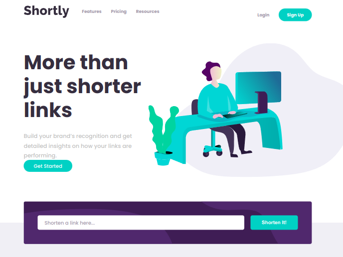

# Frontend Mentor - Shortly URL shortening API Challenge solution

This is my solution to the [Shortly URL shortening API Challenge challenge on Frontend Mentor](https://www.frontendmentor.io/challenges/url-shortening-api-landing-page-2ce3ob-G). Frontend Mentor challenges help you improve your coding skills by building realistic projects. 

## Table of contents

- [Overview](#overview)
  - [The challenge](#the-challenge)
  - [Screenshot](#screenshot)
  - [Built with](#built-with)
  - [What I learned](#what-i-learned)
  - [Useful resources](#useful-resources)
- [Author](#author)

## Overview
This is a url shortening website. Users can post a link, and get a shorter version of the original link

Live site - https://urlshorteningwebsite.netlify.app/

### The challenge

Users should be able to:

- View the optimal layout for the site depending on their device's screen size
- Shorten any valid URL

### Screenshot

### Built with

- JavaScript
- Semantic HTML5 markup
- CSS custom properties
- Flexbox
- CSS Grid
-Media queries

### What I learnt
I learnt JavaScript methods, properties, and how to retrieve and post data. I also learnt CRUD operations at a detailed level.
This project was an excellent learning experience on Vanilla JavaScript. 

### Useful resources
- https://codepen.io/FedLover/pen/NWXPeae
- https://www.topcoder.com/thrive/articles/fetch-api-javascript-how-to-make-get-and-post-requests

### Author
Catherine Kiiru
